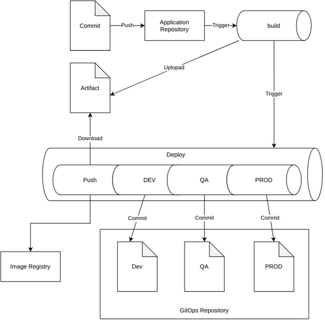

# GitOps
The GitOps templates are meant to be used with Flux v1 to build docker images and update a repository with the new image tag.

## Architecture


## Template Format
Parameter names that end with  `Template` will be templated before they are used.  They are templted with the [format command](https://docs.microsoft.com/en-us/azure/devops/pipelines/process/templates?view=azure-devops#format).
The format command is passed the environment name, which can be placed in the string.

## Build
| Name | Default | Description |
| --- | --- | --- |
| poolVmImage | `"ubuntu-22.04"` | VM Image to set in pool configuration. |
| poolName | `""` | Pool name to set in pool configuration. |
| sourceBranch | `"refs/heads/master"` | Source branch to limit image builds to. |
| dockerfilePath | `"./Dockerfile"` | Path to Dockerfile used in build. |
| dockerBuildArgs | `""` | Additional build args to append when building docker image. |
| serviceName | `""` | Name of application or service, will also be the name of the image. |
| enableDockerBuildkit | `false` | Should [`DOCKER_BUILDKIT=1`](https://docs.docker.com/develop/develop-images/build_enhancements/#to-enable-buildkit-builds) be set when running docker build. |
| preBuild | `[]` | Steps to run  before Docker build, takes a list of steps. |
| postBuild | `[]` | Steps to run  after Docker build, takes a list of steps. |
| dockerLint.enable | `true` | Enable running Docker lint step. |
| dockerLint.ignoreRuleViolations | `true` | Continues if any Docker lint violations occur. |
| imageScan.enable | `true` | Enable running Image scan step. |
| imageScan.ignoreRuleViolations | `true` | Continues if any Image scan violations occur. |
| binaries.hadolint.tag | `v.18.0` | Version of hadolint to download. |
| binaries.hadolint.sha | `f9bc9de12438b463ca84e77fde70b07b155d4da07ca21bc3f4354a62c6199db4` | SHA sum to verify downloaded hadolint binary with. |
| binaries.trivy.tag | `v0.12.0 | Version of trivy to download. |
| binaries.trivy.sha | `4003d993d4b6b5673d4ef6e216578e8ac2bf6b439201a8e748a75fc68430c3f5` | SHA sum to verify downloaded trivy archive with. |

## Deploy
| Name | Default | Description |
| --- | --- | --- |
| poolNameTemplate | `""` | Name of pool to use in template format. |
| sourceBranch | `"refs/heads/master"` | Source branch to limit image builds to. |
| serviceName | `""` | Name of the service, should match service name in build. |
| azureSubscriptionTemplate | `""` | Name of Azure subscription in template format. |
| acrNameTemplate | `""` | Name of ACr to use in template format. |
| imagePathPrefix | `""` | Prefix to append to image name before pushing to ACR. |
| gitopsRepoBranch | `"master"` | The branch used for the GitOps repository. |
| tagIsFullName | `false` | Set to true if the new tag is full name (registry/image:tag). |
| environments | `[{name: dev, deployTags: false, extraTag: "latest"}, {name: qa, deployTags: true}, {name: prod, deployTags: true}]` | Environments that should be deployed to. |

## Examples
**Build**
```yaml
name: $(Build.BuildId)

trigger:
  batch: true
  branches:
    include:
      - master
  tags:
    include:
      - "*"
  paths:
    include:
      - "*"

resources:
  repositories:
    - repository: templates
      type: git
      name: XenitKubernetesService/azure-devops-templates
      ref: refs/tags/2020.10.0

stages:
  - template: gitops/build/main.yaml@templates
    parameters:
      serviceName: "podinfo"
```

**Deploy**
```yaml
name: $(Build.BuildId)

trigger: none

resources:
  repositories:
    - repository: templates
      type: git
      name: XenitKubernetesService/azure-devops-templates
      ref: refs/tags/2020.10.2
  pipelines:
    - pipeline: ciPipeline
      source: ci-podinfo
      trigger:
        stages:
        - cd_trigger # Stage will only trigger if the build reason isn't pull request

stages:
  - template: gitops/deploy/main.yaml@templates
    parameters:
      poolNameTemplate: "xks-{0}"
      serviceName: "podinfo"
      azureSubscriptionTemplate: "azure-{0}-lab-contributor"
      acrNameTemplate: "acr{0}wexks"
      imagePathPrefix: "lab"
      imageTagPath: ".spec.values.application.buildId"
      environments:
        - name: dev
          deployTags: false
          extraTag: "latest"
```
