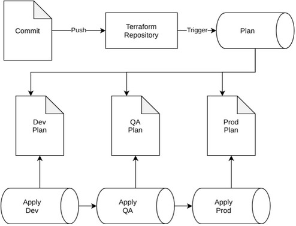

# Terraform
The Terraform templates are used to run Terraform in a `dev->qa->prod` environment promotion flow.

## Architecture


## Template Format
Parameter names that end with  `Template` will be templated before they are used.  They are templted with the [format command](https://docs.microsoft.com/en-us/azure/devops/pipelines/process/templates?view=azure-devops#format).
The format command is passed the environment name, which can be placed in the string.

## Plan
| Name | Default | Description |
| --- | --- | --- |
| poolNameTemplate | `""` | Name of pool to use in template format. |
| sourceBranch | `"refs/heads/master"` | Source branch to limit image builds to. |
| terraformLint.enable | `true` | Enable running Terraform lint step. |
| terraformLint.ignoreRuleViolations | `true` | Continues if any Terraform lint violations occur. |
| binaries.tflint.tag | `v0.20.3` | Version of tflint to download. |
| binaries.tflint.sha | `e993129a256a8c4303bf883e973a922f63160b6e8b7ab0bb4d33bb0f87b00db2` | SHA sum to verify downloaded tflint binary with. |
| environments | `[{name: dev}, {name: qa}, {name: prod}]` | Environments that should be deployed to. |
| azureSubscriptionTemplate | `""` | Name of Azure subscription in template format. |
| terraformVersion | `0.13.4` | Version of Terraform to use. |
| terraformFolder | `""` | Path to Terraform directory. |
| opaBlastRadius | `50` | Highest allowable blast radius when running plan. |

## Apply
| Name | Default | Description |
| --- | --- | --- |
| poolNameTemplate | `""` | Name of pool to use in template format. |
| sourceBranch | `"refs/heads/master"` | Source branch to limit image builds to. |
| azureSubscriptionTemplate | `""` | Name of Azure subscription in template format. |
| terraformVersion | `0.13.4` | Version of Terraform to use. |
| terraformFolder | `""` | Path to Terraform directory. |
| environments | `[{name: dev, deployTags: false}, {name: qa, deployTags: true}, {name: prod, deployTags: true}]` | Environments that should be deployed to. |

## Examples
```yaml
name: $(Build.BuildId)

trigger:
  batch: true
  branches:
    include:
      - master
  paths:
    include:
      - TF

resources:
  repositories:
    - repository: templates
      type: git
      name: PROJ/azure-devops-templates
      ref: refs/tags/2020.11.0

stages:
  - template: terraform/plan/main.yaml@templates
    parameters:
      azureSubscriptionTemplate: "SUB"
      poolNameTemplate: "POOL"
      terraformFolder: "TF"
  - template: terraform/apply/main.yaml@templates
    parameters:
      azureSubscriptionTemplate: "SUB"
      poolNameTemplate: "POOL"
      terraformFolder: "TF"
```
